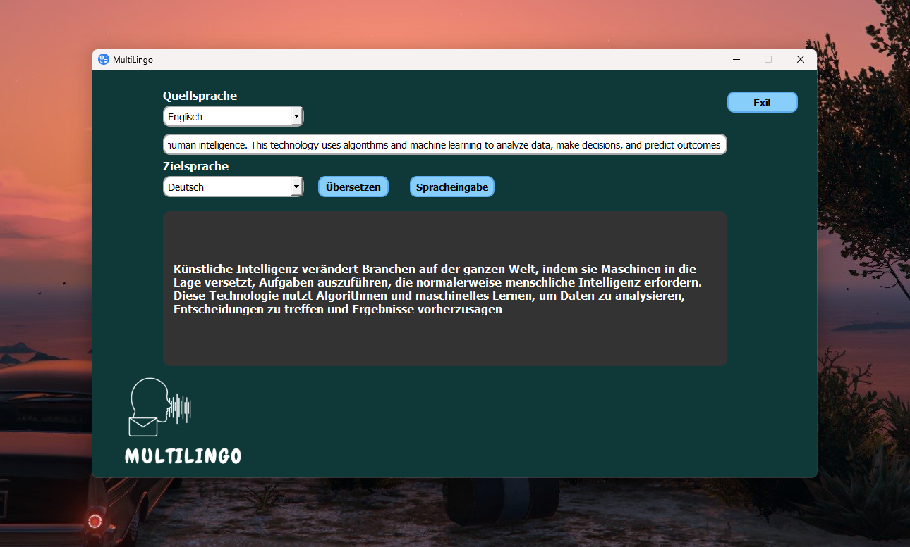

# MultiLingo

**MultiLingo** ist eine benutzerfreundliche Desktop-Anwendung, entwickelt mit PyQt5 und Azure Cognitive Services, die leistungsstarke Übersetzungs- und Spracherkennungsdienste nutzt, um Echtzeit-Sprach- und Textübersetzungen anzubieten.

## Beschreibung

MultiLingo nutzt die Azure Translator und Azure Speech Services, um eine reibungslose Übersetzung zwischen mehreren Sprachen zu ermöglichen. Es wurde entworfen, um Sprachbarrieren in der Kommunikation durch schnelle und effektive Übersetzungen zu überwinden.

## Features

- **Textübersetzung:** Übersetzen Sie Texte zwischen mehreren Sprachen direkt in der Anwendung.
- **Spracheingabe:** Nutzen Sie Ihr Mikrofon, um gesprochenen Text aufzunehmen und in eine andere Sprache zu übersetzen.
- **Unterstützte Sprachen:** Deutsch, Englisch, Französisch, Spanisch, Chinesisch und Arabisch.

## Technologien

- **Python 3.10:** Hauptprogrammiersprache.
- **PyQt5:** Für die GUI-Komponenten.
- **Azure Cognitive Services:** Für Übersetzungs- und Spracherkennungsdienste.

## Systemanforderungen

Stellen Sie sicher, dass Python 3.10 auf Ihrem System installiert ist, um Kompatibilitätsprobleme zu vermeiden.

## Setup und Installation

Um **MultiLingo** zu verwenden, folgen Sie diesen Schritten:

1. **Klonen Sie das Repository:**
   ```bash
   git clone https://github.com/yourusername/MultiLingo.git

2. **Installieren Sie die erforderlichen Pakete:**
   ```bash
   pip install -r requirements.txt
3. **Konfigurieren Sie Ihre Azure API-Schlüssel:**
   - **Kopieren Sie die config.py.template Datei und benennen Sie sie um in config.py.**
   - **Öffnen Sie die config.py Datei und tragen Sie Ihre Azure API-Schlüssel und die entsprechenden Regionen ein.**
     
4. **Starten Sie die Anwendung:**
   ```bash
   python multilingo.py 
   


   

## Screenshots

Deutsch zu Arbaisch mit Spracheingabe 


Englisch zu Deutsch 




