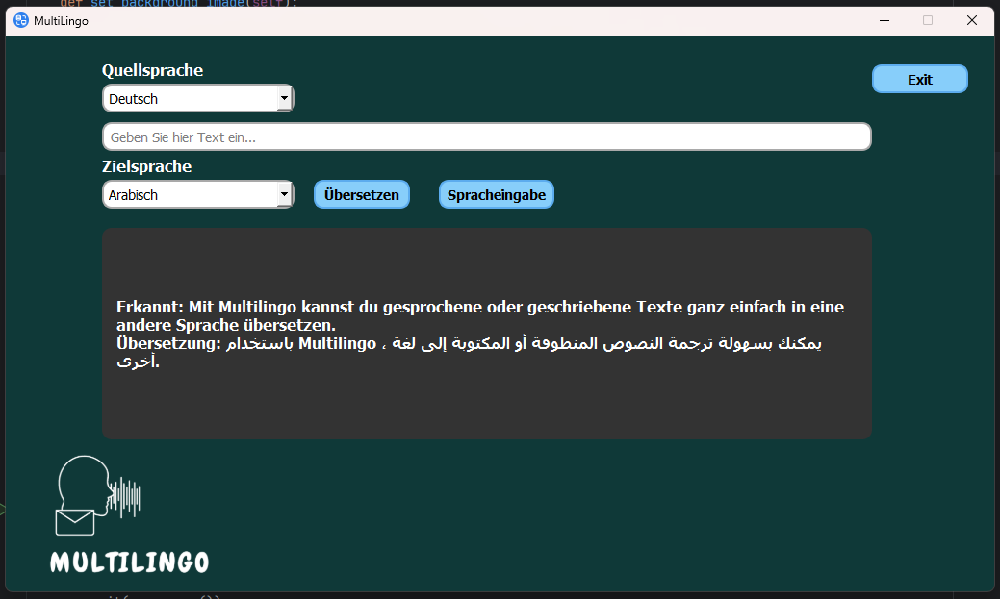

# MultiLingo

**MultiLingo** ist eine benutzerfreundliche Desktop-Anwendung, entwickelt mit PyQt5 und Azure Cognitive Services, die leistungsstarke Übersetzungs- und Spracherkennungsdienste nutzt, um Echtzeit-Sprach- und Textübersetzungen anzubieten.

## Beschreibung

MultiLingo nutzt die Azure Translator und Azure Speech Services, um eine reibungslose Übersetzung zwischen mehreren Sprachen zu ermöglichen. Es wurde entworfen, um Sprachbarrieren in der Kommunikation durch schnelle und effektive Übersetzungen zu überwinden.

## Features

- **Textübersetzung:** Übersetzen Sie Texte zwischen mehreren Sprachen direkt in der Anwendung.
- **Spracheingabe:** Nutzen Sie Ihr Mikrofon, um gesprochenen Text aufzunehmen und in eine andere Sprache zu übersetzen.
- **Unterstützte Sprachen:** Deutsch, Englisch, Französisch, Spanisch, Chinesisch und Arabisch.

## Technologien

- **Python 3.10:** Hauptprogrammiersprache.
- **PyQt5:** Für die GUI-Komponenten.
- **Azure Cognitive Services:** Für Übersetzungs- und Spracherkennungsdienste.

## Systemanforderungen

Stellen Sie sicher, dass Python 3.10 auf Ihrem System installiert ist, um Kompatibilitätsprobleme zu vermeiden.

## Screenshots

